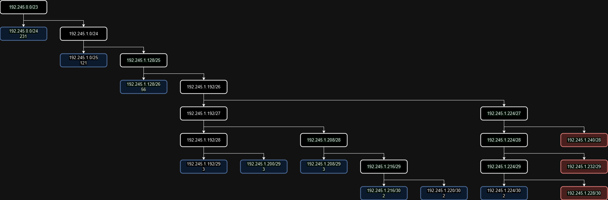

# Jarkom-Modul-5-IT24-2024

| Nama | NRP |
|---|---|
|Amoes Noland|5027231028|
|Radella Chesa Syaharani|5027231064|

## Daftar Isi

- [Jarkom-Modul-5-IT24-2024](#jarkom-modul-5-it24-2024)
	- [Daftar Isi](#daftar-isi)
- [Misi 1: Memetakan Kota New Eridu](#misi-1-memetakan-kota-new-eridu)
	- [Soal 1: Topologi](#soal-1-topologi)
	- [Soal 2: VLSM](#soal-2-vlsm)
		- [Tree](#tree)
		- [Routing Table](#routing-table)
		- [Pembagian IP](#pembagian-ip)
	- [Soal 3: Subnetting/Routing](#soal-3-subnettingrouting)
		- [Subnetting](#subnetting)
			- [NewEridu (Router) - A1, A5](#neweridu-router---a1-a5)
			- [LuminaSquare (Router) - A1, A2, A3](#luminasquare-router---a1-a2-a3)
			- [Jane (Client) - A2, 200Host](#jane-client---a2-200host)
			- [Policeboo (Client) - A2, 30Host](#policeboo-client---a2-30host)
			- [HIA (Webserver) - A3](#hia-webserver---a3)
			- [BalletTwins (Router) - A3, A4](#ballettwins-router---a3-a4)
			- [Ellen (Client) - A4, 100Host](#ellen-client---a4-100host)
			- [Lycaon (Client) - A4, 20Host](#lycaon-client---a4-20host)
			- [SixStreet (Router) - A5, A6, A7](#sixstreet-router---a5-a6-a7)
			- [Fairy (DHCP) - A6](#fairy-dhcp---a6)
			- [HDD (DNS) - A6](#hdd-dns---a6)
			- [OuterRing (Router) - A7, A8](#outerring-router---a7-a8)
			- [Caesar (Client) - A8, 50Host](#caesar-client---a8-50host)
			- [Burnice (Client) - A8, 5Host](#burnice-client---a8-5host)
			- [ScootOutpost (Router) - A7, A9](#scootoutpost-router---a7-a9)
			- [HollowZero (Webserver) - A9](#hollowzero-webserver---a9)
		- [Routing](#routing)
			- [NewEridu (Router) - Selain A1, A5](#neweridu-router---selain-a1-a5)
			- [LuminaSquare (Router) - Selain A1, A2, A3, A5-9](#luminasquare-router---selain-a1-a2-a3-a5-9)
			- [BalletTwins (Router) - Selain A3, A4, A5-9](#ballettwins-router---selain-a3-a4-a5-9)
			- [SixStreet (Router) - Selain A1-4, A5, A6, A7](#sixstreet-router---selain-a1-4-a5-a6-a7)
			- [OuterRing (Router) - Selain A1-4, A7, A8](#outerring-router---selain-a1-4-a7-a8)
			- [ScootOutpost (Router) - Selain A1-4, A7, A9](#scootoutpost-router---selain-a1-4-a7-a9)
	- [Soal 4: Konfigurasi](#soal-4-konfigurasi)
		- [DHCP Server: dhcp-server.sh](#dhcp-server-dhcp-serversh)
		- [DHCP Relay: dhcp-relay.sh](#dhcp-relay-dhcp-relaysh)
		- [DNS Server: dns.sh](#dns-server-dnssh)
		- [Web Server: webserver.sh](#web-server-webserversh)
		- [Client: Install Keperluan](#client-install-keperluan)
- [Misi 2: Menemukan Jejak Sang Peretas](#misi-2-menemukan-jejak-sang-peretas)
	- [Soal 1: iptables.sh - NewEridu](#soal-1-iptablessh---neweridu)
	- [Soal 2: iptables.sh - Fairy](#soal-2-iptablessh---fairy)
	- [Soal 3: iptables.sh - HDD](#soal-3-iptablessh---hdd)
	- [Soal 4: iptables.sh - HollowZero](#soal-4-iptablessh---hollowzero)
	- [Soal 5: iptables.sh - HIA](#soal-5-iptablessh---hia)
	- [Soal 6: iptables.sh - HIA](#soal-6-iptablessh---hia)
	- [Soal 7: iptables.sh - HollowZero](#soal-7-iptablessh---hollowzero)
	- [Soal 8: iptables.sh - Burnice](#soal-8-iptablessh---burnice)
- [Misi 3: Menangkap Burnice](#misi-3-menangkap-burnice)
	- [Soal 1: capture.sh - Burnice](#soal-1-capturesh---burnice)

# Misi 1: Memetakan Kota New Eridu

## Soal 1: Topologi

> Sebuah topologi sederhana menggambarkan jaringan New Eridu:
```
Keterangan:
HDD: Berfungsi sebagai DNS Server.
Fairy: Berfungsi sebagai DHCP Server.
Web Servers: HIA, HollowZero.
Client:
  Burnice: Memiliki 5 host.
  Lycaon: Memiliki 20 host.
  Policeboo: Memiliki 30 host.
  Caesar: Memiliki 50 host
  Ellen: Memiliki 100 host.
  Jane: Memiliki 200 host.
```


## Soal 2: VLSM

> Setelah membagi alamat IP menggunakan VLSM, gambarkan pohon subnet yang menunjukkan hierarki pembagian IP di jaringan New Eridu. Lingkari subnet-subnet yang akan dilewati dalam jaringan.
### Tree


### Routing Table

Nama Subnet | Rute | Jumlah IP | Netmask
---|---|---|---|
A1 | NewEridu > LuminaSquare | 2 | /30
A2 | NewEridu > LuminaSquare > PubSec > Policeboo + Jane | 231 | /24
A3 | NewEridu > LuminaSquare > Ofc.Mewmew > HIA + BalletTwins | 3 | /29
A4 | NewEridu > LuminaSquare > Ofc.Mewmew > BalletTwins > Victoria > Lycaon + Ellen | 121 | /25
A5 | NewEridu > SixStreet | 2 | /30
A6 | NewEridu > SixStreet > RandomPlay > HDD + Fairy | 3 | /29
A7 | NewEridu > SixStreet > Metro > ScootOutpost + OuterRing | 3 | /29
A8 | NewEridu > SixStreet > Metro > OuterRing > SoC > Caesar + Burnice | 56 | /26
A9 | NewEridu > SixStreet > Metro > ScootOutpost > HollowZero | 2 | /30
Total |  | 423 | /23

### Pembagian IP

Subnet | Network ID | Netmask | Broadcast | Range IP
---|---|---|---|---
A1 | 192.245.1.216 | 255.255.255.252 | 192.245.1.219 | 192.245.1.217 - 192.245.1.218
A2 | 192.245.0.0 | 255.255.255.0 | 192.245.0.255 | 192.245.0.1 - 192.245.0.254
A3 | 192.245.1.192 | 255.255.255.248 | 192.245.1.199 | 192.245.1.193 - 192.245.1.198
A4 | 192.245.1.0 | 255.255.255.128 | 192.245.1.127 | 192.245.1.1 - 192.245.1.126
A5 | 192.245.1.220 | 255.255.255.252 | 192.245.1.223 | 192.245.1.221 - 192.245.1.222
A6 | 192.245.1.200 | 255.255.255.248 | 192.245.1.207 | 192.245.1.201 - 192.245.1.206
A7 | 192.245.1.208 | 255.255.255.248 | 192.245.1.215 | 192.245.1.209 - 192.245.1.214
A8 | 192.245.1.128 | 255.255.255.192 | 192.245.1.191 | 192.245.1.129 - 192.245.1.190
A9 | 192.245.1.224 | 255.255.255.252 | 192.245.1.227 | 192.245.1.225 - 192.245.1.226

## Soal 3: Subnetting/Routing

> Setelah pembagian IP selesai, buatlah konfigurasi rute untuk menghubungkan semua subnet dengan benar di jaringan New Eridu. Pastikan perangkat dapat saling terhubung

### Subnetting

#### NewEridu (Router) - A1, A5

```
#NAT
auto eth0
iface eth0 inet dhcp
#A1
auto eth1
iface eth1 inet static
	address 192.245.1.217
	netmask 255.255.255.252
#A5
auto eth2
iface eth2 inet static
	address 192.245.1.221
	netmask 255.255.255.252
```

#### LuminaSquare (Router) - A1, A2, A3

```
#A1
auto eth0
iface eth0 inet static
	address 192.245.1.218
	netmask 255.255.255.252
	gateway 192.245.1.217
#A2
auto eth1
iface eth1 inet static
	address 192.245.0.1
	netmask 255.255.255.0
#A3
auto eth2
iface eth2 inet static
	address 192.245.1.193
	netmask 255.255.255.248
```

#### Jane (Client) - A2, 200Host

```
auto eth0
iface eth0 inet dhcp
```

#### Policeboo (Client) - A2, 30Host

```
auto eth0
iface eth0 inet dhcp
```

#### HIA (Webserver) - A3

```
#A3
auto eth0
iface eth0 inet static
	address 192.245.1.195
	netmask 255.255.255.248
  gateway 192.245.1.193
```

#### BalletTwins (Router) - A3, A4

```
#A3
auto eth0
iface eth0 inet static
	address 192.245.1.194
	netmask 255.255.255.248
  gateway 192.245.1.193
#A4
auto eth1
iface eth1 inet static
  address 192.245.1.1
	netmask 255.255.255.128
```

#### Ellen (Client) - A4, 100Host

```
auto eth0
iface eth0 inet dhcp
```

#### Lycaon (Client) - A4, 20Host

```
auto eth0
iface eth0 inet dhcp
```

#### SixStreet (Router) - A5, A6, A7

```
#A5
auto eth0
iface eth0 inet static
	address 192.245.1.222
	netmask 255.255.255.252
	gateway 192.245.1.221
#A6
auto eth1
iface eth1 inet static
	address 192.245.1.201
	netmask 255.255.255.248
#A7
auto eth2
iface eth2 inet static
	address 192.245.1.209
	netmask 255.255.255.248
```

#### Fairy (DHCP) - A6

```
#A6
auto eth0
iface eth0 inet static
	address 192.245.1.202
	netmask 255.255.255.248
	gateway 192.245.1.201
```

#### HDD (DNS) - A6

```
#A6
auto eth0
iface eth0 inet static
	address 192.245.1.203
	netmask 255.255.255.248
	gateway 192.245.1.201
```

#### OuterRing (Router) - A7, A8

```
#A7
auto eth0
iface eth0 inet static
	address 192.245.1.210
	netmask 255.255.255.248
	gateway 192.245.1.209
#A8
auto eth1
iface eth1 inet static
	address 192.245.1.129
	netmask 255.255.255.192
```


#### Caesar (Client) - A8, 50Host

```
auto eth0
iface eth0 inet dhcp
```

#### Burnice (Client) - A8, 5Host

```
auto eth0
iface eth0 inet dhcp
```

#### ScootOutpost (Router) - A7, A9

```
#A7
auto eth0
iface eth0 inet static
	address 192.245.1.211
	netmask 255.255.255.248
	gateway 192.245.1.209
#A9
auto eth1
iface eth1 inet static
	address 192.245.1.225
	netmask 255.255.255.252
```

#### HollowZero (Webserver) - A9

```
#A9
auto eth0
iface eth0 inet static
	address 192.245.1.226
	netmask 255.255.255.252
	gateway 192.245.1.225
```


### Routing

#### NewEridu (Router) - Selain A1, A5

```bash
# Melewati A1: (A2-A4)
post-up route add -net 192.245.0.0 netmask 255.255.255.0 gw 192.245.1.218
post-up route add -net 192.245.1.192 netmask 255.255.255.248 gw 192.245.1.218
post-up route add -net 192.245.1.0 netmask 255.255.255.128 gw 192.245.1.218
# Melewati A5: (A6-A9)
post-up route add -net 192.245.1.200 netmask 255.255.255.248 gw 192.245.1.222
post-up route add -net 192.245.1.208 netmask 255.255.255.248 gw 192.245.1.222
post-up route add -net 192.245.1.128 netmask 255.255.255.192 gw 192.245.1.222
post-up route add -net 192.245.1.224 netmask 255.255.255.252 gw 192.245.1.222
```

#### LuminaSquare (Router) - Selain A1, A2, A3, A5-9

```bash
# Pulang
post-up route add -net 0.0.0.0 netmask 0.0.0.0 gw 192.245.1.217
# A4
post-up route add -net 192.245.1.0 netmask 255.255.255.128 gw 192.245.1.194
```

#### BalletTwins (Router) - Selain A3, A4, A5-9

```bash
# Pulang (Termasuk A1 dan A2)
post-up route add -net 0.0.0.0 netmask 0.0.0.0 gw 192.245.1.192
```

#### SixStreet (Router) - Selain A1-4, A5, A6, A7

```bash
# Pulang
post-up route add -net 0.0.0.0 netmask 0.0.0.0 gw 192.245.1.221
# A8 dan A9
post-up route add -net 192.245.1.128 netmask 255.255.255.192 gw 192.245.1.210
post-up route add -net 192.245.1.224 netmask 255.255.255.252 gw 192.245.1.211
```

#### OuterRing (Router) - Selain A1-4, A7, A8

```bash
# Pulang
post-up route add -net 0.0.0.0 netmask 0.0.0.0 gw 192.245.1.209
# A9
post-up route add -net 192.245.1.224 netmask 255.255.255.252 gw 192.245.1.211
```
#### ScootOutpost (Router) - Selain A1-4, A7, A9

```bash
# Pulang
post-up route add -net 0.0.0.0 netmask 0.0.0.0 gw 192.245.1.209
# A8
post-up route add -net 192.245.1.128 netmask 255.255.255.192 gw 192.245.1.210
```

## Soal 4: Konfigurasi

> Dikerjakan setelah Misi 2 Nomor 1:
* Fairy sebagai DHCP Server agar perangkat yang berada dalam Burnice, Caesar, Ellen, Jane, Lycaon, dan Policeboo dapat menerima IP secara otomatis
* OuterRing, BalletTwins, Sixstreet dan LuminaSquare Sebagai DHCP Relay
* HDD sebagai DNS Server
* HIA dan HollowZero sebagai Webserver (gunakan apache)

### DHCP Server: dhcp-server.sh
```bash
echo 'nameserver 192.168.122.1' > /etc/resolv.conf
apt-get update && apt-get install isc-dhcp-server netcat -y

echo '
INTERFACESv4="eth0"
INTERFACESv6=""
' > /etc/default/isc-dhcp-server

echo '
# Jane & Policeboo (A2)
subnet 192.245.0.0 netmask 255.255.255.0 {
  range 192.245.0.2 192.245.0.254;
  option routers 192.245.0.1;
  option broadcast-address 192.245.0.255;
  option domain-name-servers 192.245.1.203;
}
# Ellen & Lycaon (A4)
subnet 192.245.1.0 netmask 255.255.255.128 {
  range 192.245.1.2 192.245.1.126;
  option routers 192.245.1.1;
  option broadcast-address 192.245.1.127;
  option domain-name-servers 192.245.1.203;
}
# Caesar & Burnice (A8)
subnet 192.245.1.128 netmask 255.255.255.192 {
  range 192.245.1.130 192.245.1.190;
  option routers 192.245.1.129;
  option broadcast-address 192.245.1.191;
  option domain-name-servers 192.245.1.203;
}
# DHCP server
subnet 192.245.1.200 netmask 255.255.255.248 {}
' > /etc/dhcp/dhcpd.conf

service isc-dhcp-server restart
```

### DHCP Relay: dhcp-relay.sh
```bash
echo 'nameserver 192.168.122.1' > /etc/resolv.conf
apt-get update && apt-get install isc-dhcp-relay -y

# IP Fairy: 192.245.1.202
echo '
SERVERS="192.245.1.202"
INTERFACES="eth0 eth1 eth2 eth3"
OPTIONS=""
' > /etc/default/isc-dhcp-relay

echo '
net.ipv4.ip_forward=1
' > /etc/sysctl.conf

service isc-dhcp-relay restart
```

### DNS Server: dns.sh
```bash
echo 'nameserver 192.168.122.1' > /etc/resolv.conf
apt-get update && apt-get install bind9 netcat -y

echo 'options {
    directory "/var/cache/bind";

    forwarders {
        192.168.122.1;
    };

    // dnssec-validation auto;

    allow-query { any; };
    auth-nxdomain no;    # conform to RFC1035
    listen-on-v6 { any; };
};' > /etc/bind/named.conf.options

service bind9 restart
```

### Web Server: webserver.sh
```bash
echo 'nameserver 192.168.122.1' > /etc/resolv.conf
apt-get update && apt-get install apache2 -y

echo "Welcome to $(hostname)" > /var/www/html/index.html

service apache2 restart
```

### Client: Install Keperluan
```bash
apt-get update && apt-get install lynx netcat nmap -y 
```

# Misi 2: Menemukan Jejak Sang Peretas

## Soal 1: iptables.sh - NewEridu

> Agar jaringan di New Eridu bisa terhubung ke luar (internet), kalian perlu mengkonfigurasi routing menggunakan iptables. Namun, kalian tidak diperbolehkan menggunakan MASQUERADE

Dengan command parsing untuk mendapatkan IP eth0 yang menggunakan dhcp:

```bash
echo 'nameserver 192.168.122.1' > /etc/resolv.conf
ETH0_IP=$(ip -4 addr show eth0 | grep -oE '([0-9]{1,3}\.){3}([0-9]{1,3})' | head -n 1)
echo $ETH0_IP
iptables -t nat -A POSTROUTING -o eth0 -j SNAT --to-source $ETH0_IP
```

## Soal 2: iptables.sh - Fairy

> Karena Fairy adalah Al yang sangat berharga, kalian perlu memastikan bahwa tidak ada perangkat lain yang bisa melakukan ping ke Fairy. Tapi Fairy tetap dapat mengakses seluruh perangkat.


```bash
# block pings TO fairy
iptables -A INPUT -p icmp --icmp-type echo-request -j DROP
# allow pings FROM fairy
iptables -A OUTPUT -p icmp --icmp-type echo-request -j ACCEPT
```

Revert:
```bash
# block pings TO fairy
iptables -D INPUT -p icmp --icmp-type echo-request -j DROP
# allow pings FROM fairy
iptables -D OUTPUT -p icmp --icmp-type echo-request -j ACCEPT
```

## Soal 3: iptables.sh - HDD

> Selain itu, agar kejadian sebelumnya tidak terulang, hanya Fairy yang dapat mengakses HDD. Gunakan nc (netcat) untuk memastikan akses ini. [hapus aturan iptables setelah pengujian selesai agar internet tetap dapat diakses.]


```bash
# accept from fairy
iptables -A INPUT -s 192.245.1.202 -j ACCEPT
# block everything else
iptables -A INPUT -j REJECT 
```

Revert:
```bash
# accept from fairy
iptables -D INPUT -s 192.245.1.202 -j ACCEPT
# block everything else
iptables -D INPUT -j REJECT 
```

Test: 
* `nc 192.245.1.203 1234` - Fairy
* `nc -nvlp 1234` - HDD

## Soal 4: iptables.sh - HollowZero

> Fairy mendeteksi aktivitas mencurigakan di server Hollow. Namun, berdasarkan peraturan polisi New Eridu, Hollow hanya boleh diakses pada hari Senin hingga Jumat dan hanya oleh faksi SoC (Burnice & Caesar) dan PubSec (Jane & Policeboo). Karena hari ini hari Sabtu, mereka harus menunggu hingga hari Senin. Gunakan curl untuk memastikan akses ini.

```bash
# Input IP Burnice, Caesar, Jane, and Policeboo
iptables -A INPUT -p tcp -s 192.245.x.x --dport 80 -m time --timestart 00:00 --timestop 23:59 --weekdays Mon,Tue,Wed,Thu,Fri -j ACCEPT
iptables -A INPUT -p tcp -s 192.245.x.x --dport 80 -m time --timestart 00:00 --timestop 23:59 --weekdays Mon,Tue,Wed,Thu,Fri -j ACCEPT
iptables -A INPUT -p tcp -s 192.245.x.x --dport 80 -m time --timestart 00:00 --timestop 23:59 --weekdays Mon,Tue,Wed,Thu,Fri -j ACCEPT
iptables -A INPUT -p tcp -s 192.245.x.x --dport 80 -m time --timestart 00:00 --timestop 23:59 --weekdays Mon,Tue,Wed,Thu,Fri -j ACCEPT
iptables -A INPUT -p tcp --dport 80 -j REJECT
```

Test: `curl http://192.245.1.226`

## Soal 5: iptables.sh - HIA

> Sembari menunggu, Fairy menyarankan Phaethon untuk berlatih di server HIA dan meminta bantuan dari faksi Victoria (Ellen & Lycaon) dan PubSec. Akses HIA hanya diperbolehkan untuk
>
> a. Ellen dan Lycaon pada jam 08.00-21.00.
>
> b. Jane dan Policeboo pada jam 03.00-23.00. (hak kepolisian)
>
> Gunakan curl untuk memastikan akses ini.

```bash
# Ellen & Lycaon (08:00 - 21:00)
iptables -A INPUT -p tcp -s 192.245.x.x --dport 80 -m time --timestart 01:00 --timestop 14:00 --weekdays Mon,Tue,Wed,Thu,Fri,Sat,Sun -j ACCEPT
iptables -A INPUT -p tcp -s 192.245.x.x --dport 80 -m time --timestart 01:00 --timestop 14:00 --weekdays Mon,Tue,Wed,Thu,Fri,Sat,Sun -j ACCEPT

# Jane & Policeboo (03:00 - 23:00)
iptables -A INPUT -p tcp -s 192.245.x.x --dport 80 -m time --timestart 20:00 --timestop 16:00 --weekdays Mon,Tue,Wed,Thu,Fri,Sat,Sun -j ACCEPT
iptables -A INPUT -p tcp -s 192.245.x.x --dport 80 -m time --timestart 20:00 --timestop 16:00 --weekdays Mon,Tue,Wed,Thu,Fri,Sat,Sun -j ACCEPT

iptables -A INPUT -p tcp --dport 80 -j REJECT # reject other requests
```

Test: `curl http://192.245.1.195` (harus di UTC time)

## Soal 6: iptables.sh - HIA

> Sebagai bagian dari pelatihan, PubSec diminta memperketat keamanan jaringan di server HIA. Jane dan Policeboo melakukan simulasi port scan menggunakan nmap pada rentang port 1-100.
>
> a. Web server harus memblokir aktivitas scan port yang melebihi 25 port secara otomatis dalam rentang waktu 10 detik.
>
> b. Penyerang yang terblokir tidak dapat melakukan ping, nc, atau curl ke HIA.
>
> c. Catat log dari iptables untuk keperluan analisis dan dokumentasikan dalam format PDF.

```bash
# rate limit -  25conn/10s
iptables -N PORTSCAN
iptables -A INPUT -p tcp --dport 1:100 -m state --state NEW -m recent --set --name portscan
iptables -A INPUT -p tcp --dport 1:100 -m state --state NEW -m recent --update --seconds 10 --hitcount 25 --name portscan -j PORTSCAN

# block attackers (port scanning)
iptables -A PORTSCAN -m recent --set --name blacklist
iptables -A PORTSCAN -j DROP

# block all activities from blacklisted IPs
iptables -A INPUT -m recent --name blacklist --rcheck -j REJECT
iptables -A OUTPUT -m recent --name blacklist --rcheck -j REJECT

iptables -A PORTSCAN -j LOG --log-prefix='PORT SCAN DETECTED' --log-level 4 # logging
```

Test: `nmap -p 1-100 192.245.1.195`, ping, curl, nc

## Soal 7: iptables.sh - HollowZero

> Hari Senin tiba, dan Fairy menyarankan membatasi akses ke server Hollow. Akses ke Hollow hanya boleh berasal dari 2 koneksi aktif dari 2 IP yang berbeda dalam waktu bersamaan. Burnice, Caesar, Jane, dan Policeboo diminta melakukan uji coba menggunakan curl.

```bash
# max 2 conns from 2 diff IPs
iptables -A INPUT -p tcp --dport 80 -m conntrack --ctstate NEW -m recent --set
iptables -A INPUT -p tcp --dport 80 -m conntrack --ctstate NEW -m recent --update --seconds 1 --hitcount 3 -j REJECT
iptables -A INPUT -p tcp --dport 80 -j ACCEPT
```

Test: `parallel curl -s http://IP-HollowZero ::: 192.245.1.x 192.245.1.x 192.245.0.x 192.245.0.x`

## Soal 8: iptables.sh - Burnice

> Selama uji coba, Fairy mendeteksi aktivitas mencurigakan dari Burnice. Setiap paket yang dikirim Fairy ke Burnice ternyata dialihkan ke HollowZero. Gunakan nc untuk memastikan alur pengalihan ini.


```bash
iptables -t nat -A PREROUTING -p tcp -j DNAT --to-destination 192.245.1.226 --dport 8080
iptables -A FORWARD -p tcp -d 192.245.1.226 -j ACCEPT
```

```bash
nc 192.245.1.x 8080 #IP Burnice
nc -nlvp 8080 #Accept TCP
```

Setelah menjalankan command diatas, nc yang mengarah ke Burnice seharusnya dialihkan ke HollowZero (192.245.1.226), dan bisa dicek melalui tcpdump: `tcpdump -i eth0 host 192.245.1.x and port 8080`

# Misi 3: Menangkap Burnice

## Soal 1: capture.sh - Burnice

> Mengetahui hal tersebut Wise dan Belle mengambil langkah drastis: memblokir semua lalu lintas yang masuk dan keluar dari Burnice, gunakan nc dan ping. **Burnice ya bukan Caesar**


```bash
iptables --policy INPUT DROP
iptables --policy OUTPUT DROP
iptables --policy FORWARD DROP
```