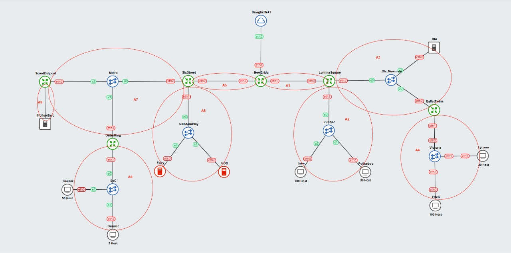

# Jarkom-Modul-5-IT24-2024

| Nama | NRP |
|---|---|
|Amoes Noland|5027231028|
|Radella Chesa Syaharani|5027231064|

## Daftar Isi

- [Jarkom-Modul-5-IT24-2024](#jarkom-modul-5-it24-2024)
  - [Daftar Isi](#daftar-isi)
  - [Soal 1: Topologi](#soal-1-topologi)
  - [Soal 2: VLSM](#soal-2-vlsm)
    - [Routing Table](#routing-table)
    - [Pembagian IP](#pembagian-ip)
    - [Soal 3: Subnetting/Routing](#soal-3-subnettingrouting)
      - [Subnetting](#subnetting)
      - [Routing](#routing)
    - [Soal 4:](#soal-4)


## Soal 1: Topologi

> Sebuah topologi sederhana menggambarkan jaringan New Eridu:
```
Keterangan:
HDD: Berfungsi sebagai DNS Server.
Fairy: Berfungsi sebagai DHCP Server.
Web Servers: HIA, HollowZero.
Client:
  Burnice: Memiliki 5 host.
  Lycaon: Memiliki 20 host.
  Policeboo: Memiliki 30 host.
  Caesar: Memiliki 50 host
  Ellen: Memiliki 100 host.
  Jane: Memiliki 200 host.
```



## Soal 2: VLSM

> Setelah membagi alamat IP menggunakan VLSM, gambarkan pohon subnet yang menunjukkan hierarki pembagian IP di jaringan New Eridu. Lingkari subnet-subnet yang akan dilewati dalam jaringan.

### Routing Table

Nama Subnet | Rute | Jumlah IP | Netmask
---|---|---|---|
A1 | NewEridu > LuminaSquare | 2 | /30
A2 | NewEridu > LuminaSquare > PubSec > Policeboo + Jane | 231 | /24
A3 | NewEridu > LuminaSquare > Ofc.Mewmew > HIA + BalletTwins | 3 | /29
A4 | NewEridu > LuminaSquare > Ofc.Mewmew > BalletTwins > Victoria > Lycaon + Ellen | 121 | /25
A5 | NewEridu > SixStreet | 2 | /30
A6 | NewEridu > SixStreet > RandomPlay > HDD > Fairy | 3 | /29
A7 | NewEridu > SixStreet > Metro > ScootOutpost + OuterRing | 3 | /29
A8 | NewEridu > SixStreet > Metro > OuterRing > SoC > Caesar > Burnice | 56 | /26
A9 | NewEridu > SixStreet > Metro > ScootOutpost > HollowZero | 2 | /30
Total |  | 233 | /23

### Pembagian IP

Subnet | Network ID | Netmask | Broadcast | Range IP
---|---|---|---|---
A1 | 192.245.1.216 | 255.255.255.252 | 192.245.1.219 | 192.245.1.217 - 192.245.1.218
A2 | 192.245.0.0 | 255.255.255.0 | 192.245.0.255 | 192.245.0.1 - 192.245.0.254
A3 | 192.245.1.192 | 255.255.255.248 | 192.245.1.199 | 192.245.1.193 - 192.245.1.198
A4 | 192.245.1.0 | 255.255.255.128 | 192.245.1.127 | 192.245.1.1 - 192.245.1.126
A5 | 192.245.1.220 | 255.255.255.252 | 192.245.1.223 | 192.245.1.221 - 192.245.1.222
A6 | 192.245.1.200 | 255.255.255.248 | 192.245.1.207 | 192.245.1.201 - 192.245.1.206
A7 | 192.245.1.208 | 255.255.255.248 | 192.245.1.215 | 192.245.1.209 - 192.245.1.214
A8 | 192.245.1.128 | 255.255.255.192 | 192.245.1.191 | 192.245.1.129 - 192.245.1.190
A9 | 192.245.1.224 | 255.255.255.252 | 192.245.1.227 | 192.245.1.225 - 192.245.1.226

### Soal 3: Subnetting/Routing

> Setelah pembagian IP selesai, buatlah konfigurasi rute untuk menghubungkan semua subnet dengan benar di jaringan New Eridu. Pastikan perangkat dapat saling terhubung

#### Subnetting


#### Routing

### Soal 4: 
